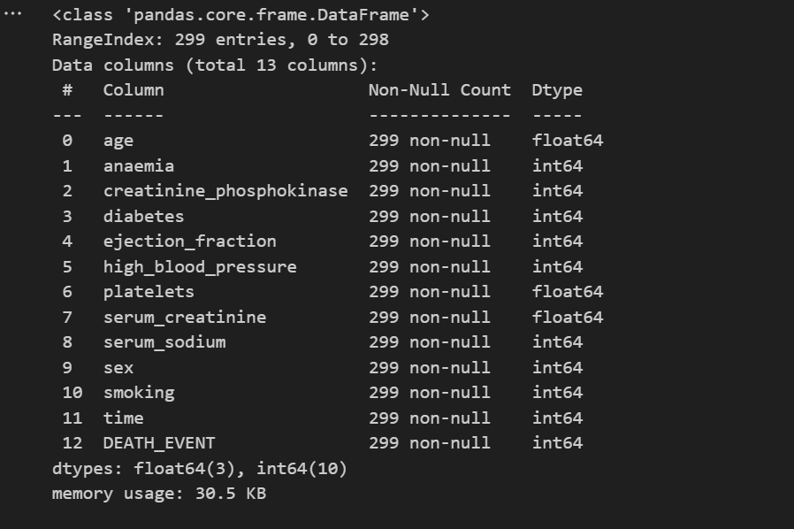
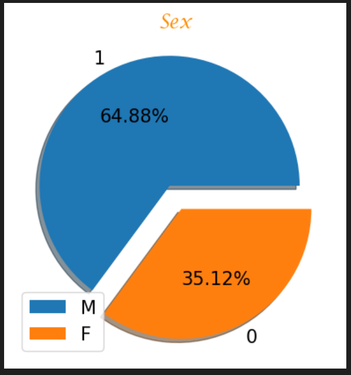

# Laporan Proyek Machine Learning
### Nama : Livia
### Nim : 211351075
### Kelas : Pagi B

## Domain Proyek

Cardiovascular diseases (CVDs) merupakan penyebab kematian no 1 di dunia, dengan estimasi korban berkisar 17.9 juta jiwa setiap tahun-nya, yang mana merupakan 31% penyebab kematian di seluruh dunia.<br>
Gagal jantung merupakan hal yang di sebabkan oleh CVD dan dataset ini memiliki 12 parimeter untuk menentukan apakah anda beresiko terkena gagal jantung atau tidak.


## Business Understanding

Orang orang dengan CVD atau beresiko tinggi terdampak CVD perlu deteksi awal dan penanganan yang mana model machine learning ini bisa menjadi salah satu media yang membantu.

Bagian laporan ini mencakup:

### Problem Statements

Latar belakang permasalahan yang di hadapi:
- Perlunya deteksi awal kecenderungan gagal jantung
- Jadwal kontrol yang tidak menentu dari rumah sakit menjadi salah satu faktor gagal jantung

### Goals

Tujuan dari model machine learning ini:
- Menjadi acuan untuk deteksi awal resiko gagal jantung
- Meningkatkan kewaspadaan anda terhadap resiko gagal jantung sehingga anda bisa cepat cepat di tangani

Semua poin di atas harus diuraikan dengan jelas. Anda bebas menuliskan berapa pernyataan masalah dan juga goals yang diinginkan.


   ### Solution statements
    - Model machine learning ini di dasari dari dataset yang mempelajari tingkat kematian dari gagal jantung
    - Model machine learning ini menggunakan metode klasifikasi dengan algoritma svm

## Data Understanding
Dataset yang digunakan dalam model machine learning ini adalah dataset yang disediakan di kaggle<br> 

[Heart Failure Prediction](https://www.kaggle.com/datasets/andrewmvd/heart-failure-clinical-data).
  
### Variabel-variabel pada Heart Failure Prediction adalah sebagai berikut:
- age = usia si pasien dengan tipe inputan integer
- anaemia = apakah si pasien memiliki anemia dengan tipe inputan integer namun saya rubah menjadi select box
- creatinine_phosphokinase = kadar CPK Enzyme dalam darah dengan satuan mcg/L dengan tipe inputan integer
- diabetes = apakah si pasien memiliki diabetes dengan tipe inputan integer namun dirubah menjadi select box
- ejection_fraction = persentase darah yang dikeluarkan oleh jantung setiap kali jantung memompa darah dengan satuan integer
- high_blood_pressure = Apakah pasien memiliki darah tinggi dengan tipe inputan integer namun dirubah menjadi select box
- serum_creatinine = Jumlah kandungan serum creatinine dalam darah dalam satuan mg/dL dengan tipe inputan integer
- serum_sodium = Jumlah kandungan serum sodium dalam darah dalam satuan mEq/L edngan tipe inputan integer
- sex = Jenis Kelamin pasien dengan tipe inputan integer namun dirubah menjadi select box
- smoking = Apakah pasien seorang perokok dengan tipe inputan integer namun dirubah menjadi select box
- time = Hari pasien hingga jadwal kontrol selanjutnya


## Data Preparation
Pertama tama kita siapkan dulu dataset yang akan digunakan untuk model machine learning ini. Jika sudah kita kemudian import library python yang akan di pergunakan

```bash
import pandas as pd 
import numpy as np
import matplotlib.pyplot as plt
from sklearn import svm
from sklearn.model_selection import train_test_split
from sklearn.preprocessing import StandardScaler
from sklearn.metrics import accuracy_score
```

Setelah itu kita Load data yang akan dipergunakan
```bash
df = pd.read_csv('D:/jantung/heart_failure_clinical_records_dataset.csv')
```
Jika sudah, kita bisa cek untuk dataset nya apakah sudah terload atau tidak
```bash
df.head()
```
Selanjutnya kita cek informasi dari ssetiap kolom dataset tersebut
```bash
df.info()
```

Maka akan muncul nama kolom dan type data nya

selnajutnya kita hitung jumlah total untuk colom DEATH_EVENT
```bash
ValueCounts_DEATH_EVENT = df['DEATH_EVENT'].value_counts()
ValueCounts_DEATH_EVENT
```
Maka akan muncul
```bash
DEATH_EVENT
0    203
1     96
Name: count, dtype: int64
```
Selanjutnya kita bisa visualisasikan data tersebut
```bash
ax = ValueCounts_DEATH_EVENT.plot(kind='bar',figsize=(8,5), width=0.40 ,color=['green','brown'] ,fontsize=15, title='A Bar graph showing values of DEATH_EVENT column' )
ax.set_xlabel("DEATH_EVENT",fontsize=15)      
ax.set_ylabel("Count",fontsize=15)
plt.show()
```

Selanjutnya kita visualisasikan dengan pie chart berdasarkan jenis kelaminya
```bash
plt.rcParams.update({'font.size': 15})
ax=df['sex'].value_counts().plot.pie(explode=[0.1, 0.1],autopct='%1.2f%%',shadow=True);
ax.set_title(label = "Sex", fontsize = 40,color='DarkOrange',font='Lucida Calligraphy');
plt.legend(labels=['M','F'])
plt.axis('off');
```


## Modeling
Jika sudah selesai melakukan EDA kita bisa lanjutkan pada proses modeling dengan menentukan nilai X dan nilai Y
```bash
X = df.drop (columns='DEATH_EVENT', axis=1)
Y = df['DEATH_EVENT']
```
Dengan perintah terserbut maka nilai X adalah kolom yang selain DEATH_EVEN dan nilai Y adalah kolom DEATH_EVENT<br>
Selanjutnya kita standarisasi dulu nilai dari dataset tersebut
```bash
scaler = StandardScaler()
```
```bash
scaler.fit(X)
```
```bash
standarized_data = scaler.transform(X)
```
Maka nilai X akan di standarkan<br>
Selanjutnya kita masukan nilai X yang sudah di standarkan
```bash
X = standarized_data
Y = df['DEATH_EVENT']
```
Selanjutnya kita pisahkan dataset untuk untuk data test dan data train
```bash
X_train, X_test, Y_train, Y_test = train_test_split(X,Y, test_size=0.3, stratify=Y, random_state=2)
```
Jika sudah, kita bisa lihat jumlah dataset akan di bagi menjadi data train 70% dan data test 30%<br>
Untuk lebih jelasnya bisa kita ketikan perintah
```bash
print(X.shape, X_train.shape, X_test.shape)
```
```bash
(299, 12) (209, 12) (90, 12)
```
Maka akan terlihat untuk data train sejumlah 209 dan data test sejumlah 90<br>
Selanjutkan kita masukan SVM nya
```bash
classifier = svm.SVC(kernel='linear')
```
```bash
classifier.fit(X_train, Y_train)
```
Selanjutnya kita cek akurasi untuk data test dan data train
```bash
x_train_prediction = classifier.predict(X_train)
training_data_accuracy = accuracy_score(x_train_prediction, Y_train)
```
```bash
print('Akurasi pada data training = ', training_data_accuracy)
```
```bash
Akurasi pada data training =  0.8325358851674641
```
untuk data training di peroleh akurasi 83%
```bash
x_test_prediction = classifier.predict(X_test)
test_data_accuracy = accuracy_score(x_test_prediction, Y_test)
```
```bash
print('Akurasi pada data test = ', test_data_accuracy)
```
```bash
Akurasi pada data test =  0.8111111111111111
```
Dan untuk akurasi dataset nya di peroleh akurasi 81%<br>
Pada tahap ini modeling sudah selesai dan kita bisa lakukan pengetesan melalui nilai array
```bash
input_data = (75.0, 0, 582, 0, 20, 1, 265000.00, 1.9, 130, 1, 0, 4)

data_array = np.array(input_data)

reshape = data_array.reshape(1,-1)

std_data = scaler.transform(reshape)
print(std_data)

prediction = classifier.predict(std_data)
print(prediction)

if (prediction[0] == 0):
    print('Tidak beresiko gagal jantung')
else :
    print('Beresiko gagal jantung')
```
```bash
[[ 1.19294523e+00 -8.71104775e-01  1.65728387e-04 -8.47579380e-01
  -1.53055953e+00  1.35927151e+00  1.68164843e-02  4.90056987e-01
  -1.50403612e+00  7.35688190e-01 -6.87681906e-01 -1.62950241e+00]]
[1]
Beresiko gagal jantung
```
Jika sudah keluar hasil maka kita bisa import model tersebut
```bash
import pickle
filename = 'gagal_jantung.sav'
pickle.dump(classifier,open(filename,'wb'))
```


## Evaluation
Pada bagian ini anda perlu menyebutkan metrik evaluasi yang digunakan. Lalu anda perlu menjelaskan hasil proyek berdasarkan metrik evaluasi yang digunakan.

Sebagai contoh, Anda memiih kasus klasifikasi dan menggunakan metrik **akurasi, precision, recall, dan F1 score**. Jelaskan mengenai beberapa hal berikut:
- Penjelasan mengenai metrik yang digunakan
- Menjelaskan hasil proyek berdasarkan metrik evaluasi

Ingatlah, metrik evaluasi yang digunakan harus sesuai dengan konteks data, problem statement, dan solusi yang diinginkan.


## Deployment
pada bagian ini anda memberikan link project yang diupload melalui streamlit share. boleh ditambahkan screen shoot halaman webnya.
